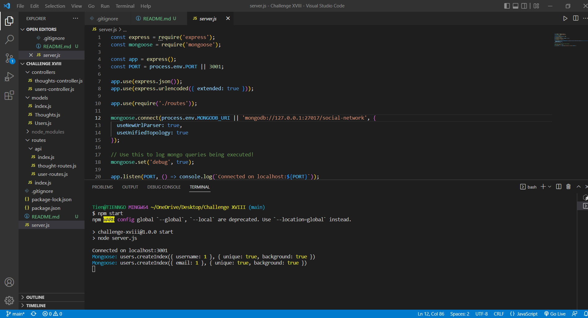

# Challenge XVIII

## Description

This is a noSQL database using MongoDB that allows for API endpoints to interact with the database. Since this database is designed for a social networking platform, the database contains API endpoints for Users, their thoughts, and their friends' reactions to those thoughts.

## Screenshot

## Walk-through Video

https://drive.google.com/file/d/1ZUYF7gDMNPef0odOwYkgnCbw-Qf4p7cL/view
